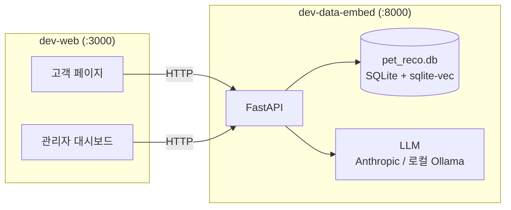

# 🐾 오늘 뭐멍냥

 

 

개·고양이 사료·간식을 반려동물 프로필(축종·체급·알러지)에 맞춰 추천하는 **RAG 기반 반려동물 추천 서비스**입니다.
정형 필터(SQL)가 먼저 후보를 거르고, 그 위에서만 LLM이 최종 추천을 고르는 구조로 — 토큰 낭비와 축종/알러지 오조합을 원천적으로 막습니다.

---

## ✨ 주요 기능

- **AI 질문 응답** — 리뷰 벡터 검색 + LLM 스트리밍 답변 (`/ask`, `/ask/me`). 답변을 만든 모델과 별도 호출로 사실관계를 대조하는 자체 반증(fact-check) 단계 포함
- **개인화 추천** — 프로필(알러지/체급/축종) 기반 필터링 → 벡터 유사도 검색 → LLM 최종 픽 (`/recommend`)
- **관리자 대시보드** — 고객 검색·상세, 구매 이력 + 지출 그래프, 이력 기반 추천, 판매 전략 제안, AI 질문 패널
- **고객 페이지** — 로그인/회원가입, 펫·구매 이력 조회, AI 질문창
- **데이터 파이프라인** — 더미 CSV → SQLite 적재 → 리뷰 청킹 → 임베딩 → recall@k/MRR 자동 평가

## 📦 저장소

| 저장소 | 역할 | 스택 |
|---|---|---|
| [**dev-data-embed**](https://github.com/TodayWhatDish/dev-data-embed) | 백엔드 — 데이터 파이프라인 + FastAPI 서비스 | Python, FastAPI, sqlite-vec, sentence-transformers, LangChain |
| [**dev-web**](https://github.com/TodayWhatDish/dev-web) | 프론트엔드 — 관리자 대시보드 + 고객 페이지 | Vanilla JS, HTML/CSS (정적 서빙, Next.js 마이그레이션 예정) |

## 🏗️ 아키텍처

`dev-web`은 자체 백엔드가 없습니다 — 모든 데이터의 원본은 `dev-data-embed`의 FastAPI입니다.

## 📄 라이선스

`dev-data-embed`는 Apache-2.0, `dev-web`은 MIT — 각 저장소의 `LICENSE`를 따릅니다.
