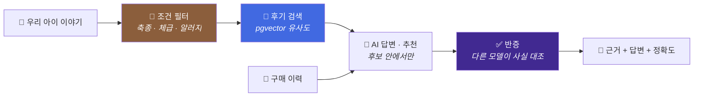
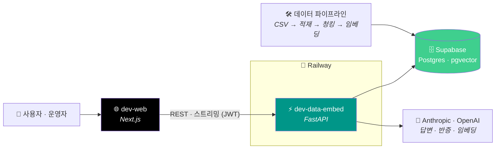

# 🐶 오늘뭐멍냥 🐱

### 우리 아이 기록이 고르는 오늘의 한 끼

**반려동물의 알러지 · 체급 · 구매 이력을 근거로, AI가 사료 · 간식을 추천하고 질문에 답하는 서비스**

 

 

 

---

## 📌 어떤 서비스인가요?

사료 · 간식은 종류가 너무 많고, 알러지가 있는 아이라면 **성분표를 하나하나 확인**해야 합니다.
오늘뭐멍냥은 **"세 살 말티즈인데 닭고기만 먹으면 긁어요"** 처럼 우리 아이 이야기를 그대로 적으면,
알러지 성분이 든 상품을 먼저 걸러 낸 뒤 **비슷한 아이를 키우는 보호자의 실제 후기**를 근거로 추천하고 답합니다.

| 🐾 반려인에게 | 🧑‍💼 판매자 · 운영자에게 |
|---|---|
| 알러지 · 체급에 맞는 후보 안에서만 추천 | 고객 구매 이력 기반 **판매 전략 · 응대안** |
| 추천마다 **근거가 된 후기**를 함께 보여 줌 | 고객 분석 대시보드 · 구매 금액 그래프 |
| 답변을 **다른 AI가 한 번 더 검사**한 정확도 표시 | 고객 질문 기록 · 추천 품질 평가 |

---

## ✨ 어떻게 믿을 만한 답을 만드나요?

```mermaid
flowchart LR
    Q["🐶 우리 아이 이야기"] --> F["🧹 조건 필터<br/><i>축종 · 체급 · 알러지</i>"]
    F --> S["🔎 후기 검색<br/><i>pgvector 유사도</i>"]
    S --> G["💬 AI 답변 · 추천<br/><i>후보 안에서만</i>"]
    H["🧾 구매 이력"] --> G
    G --> V["✅ 반증<br/><i>다른 모델이 사실 대조</i>"]
    V --> A["📱 근거 + 답변 + 정확도"]

    style F fill:#8B5E3C,color:#fff
    style S fill:#4169E1,color:#fff
    style V fill:#412991,color:#fff
```

- **필터가 먼저, AI는 나중에** — 조건에 안 맞는 상품은 AI에게 보이지도 않습니다. 오조합과 토큰 낭비를 함께 막습니다.
- **AI의 말을 그대로 믿지 않기** — 후보 밖 상품을 지어내면 다시 고르게 하고, 판매 전략의 근거 구매는 DB로 대조하며, 상담 답변은 다른 모델이 채점합니다.
- **근거를 먼저 보여 주기** — 참고한 후기와 고객 정보를 답변보다 먼저 화면에 띄워 눈으로 확인할 수 있게 합니다.

---

## 📦 저장소

| 저장소 | 역할 | 주요 기술 |
|---|---|---|
| [**dev-web**](https://github.com/TodayWhatDish/dev-web) | **프론트엔드** — 서비스 소개 사이트 · 고객 페이지 · 관리자 대시보드 | Next.js 16 · React 19 · Chart.js |
| [**dev-data-embed**](https://github.com/TodayWhatDish/dev-data-embed) | **백엔드** — 추천 · AI 상담 API, 데이터 파이프라인(CSV → DB → 임베딩), 품질 평가 | Python · FastAPI · LangChain · SQLAlchemy |

---

## 🏗️ 전체 구조

```mermaid
flowchart LR
    U["🧑 사용자 · 운영자"] --> WEB

    WEB["🌐 dev-web<br/><i>Next.js</i>"] -->|"REST · 스트리밍 (JWT)"| API

    subgraph RW["🚆 Railway"]
        API["⚡ dev-data-embed<br/><i>FastAPI</i>"]
    end

    API --> PG[("🗄️ Supabase<br/>Postgres · pgvector")]
    API --> LLM["🤖 Anthropic · OpenAI<br/><i>답변 · 반증 · 임베딩</i>"]
    PIPE["🛠️ 데이터 파이프라인<br/><i>CSV → 적재 → 청킹 → 임베딩</i>"] --> PG

    style API fill:#009688,color:#fff
    style PG fill:#3FCF8E,color:#fff
    style WEB fill:#000,color:#fff
```

---

## 🧰 기술 스택

| 영역 | 기술 |
|---|---|
| **Frontend** | Next.js 16 (App Router) · React 19 · JavaScript · Chart.js |
| **Backend** | Python 3.12 · FastAPI · Uvicorn · Pydantic · JWT · bcrypt |
| **AI · RAG** | LangChain · Anthropic (답변) · OpenAI (임베딩 · 반증) · tiktoken |
| **Database** | Supabase Postgres · pgvector · SQLAlchemy 2.0 |
| **Evaluation** | RAGAS · 골든셋 recall@k · MRR |
| **Infra** | Railway (Docker) · Supabase |
| **Quality** | pytest · Ruff · ESLint |

---

더 자세한 구조 · 실행 방법은 각 저장소 README를 참고하세요.

`dev-data-embed` Apache-2.0 · `dev-web` MIT

