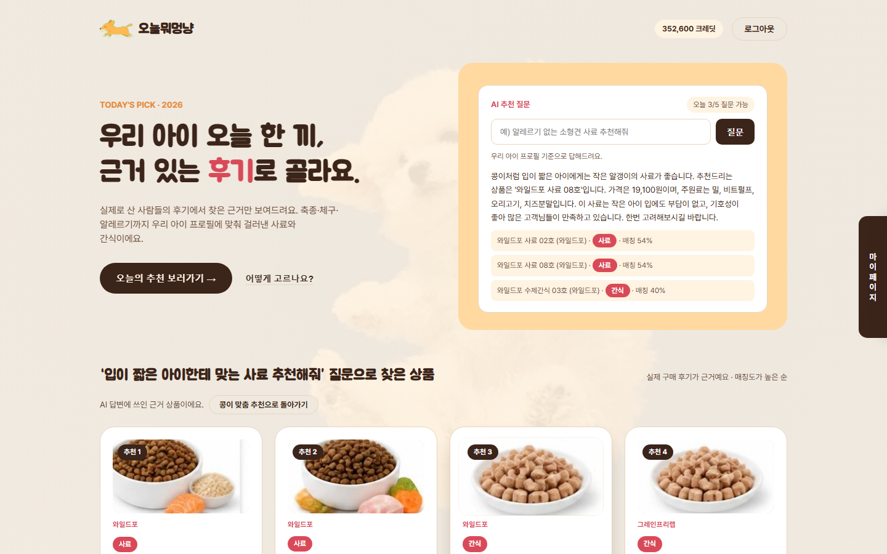
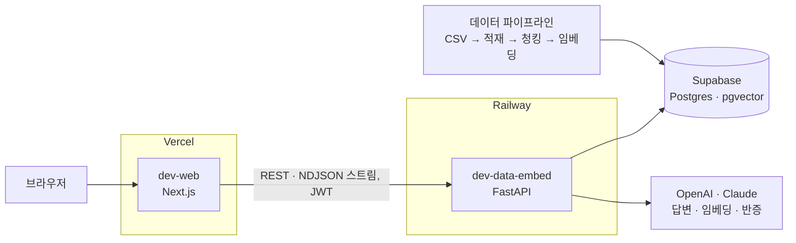

# 오늘뭐멍냥

반려동물의 알러지 · 체급 · 구매 이력을 근거로, 
AI가 사료 · 간식을 추천하고 질문에 답하는 서비스

**[서비스 바로가기 → twd-web.vercel.app](https://twd-web.vercel.app)**

 

## 소개

사료 · 간식은 종류가 너무 많고, 알러지가 있는 아이라면 성분표를 하나하나 확인해야 합니다.
오늘뭐멍냥은 "세 살 말티즈인데 닭고기만 먹으면 긁어요"처럼 우리 아이 이야기를 적으면,
알러지 성분이 든 상품을 **먼저 걸러 낸 뒤** 비슷한 아이를 키우는 보호자의 **실제 후기**를 근거로 추천하고 답합니다.

## 화면

| 고객 페이지 — AI 상담 | 관리자 — 고객 AI 분석 · 답변 반증 |
|---|---|
|  |  |

## 주요 기능

| 기능 | 설명 |
|---|---|
| **맞춤 추천** | 축종 · 체급 · 알러지로 후보를 거른 뒤, 그 안에서만 AI가 추천 |
| **AI 상담** | 유사 후기 · 구매 이력 · 성분표를 근거로 답변을 스트리밍 |
| **답변 반증** | 답변을 만든 모델과 다른 모델이 고객 정보 · 상품 자료와 대조해 정확도 표시 |
| **고객 분석 · 판매 전략** | 관리자 대시보드에서 구매 이력 · 구매 금액 그래프 · 응대안 확인 |
| **품질 평가** | 홀드아웃 후기로 recall@k · MRR, RAGAS 채점 |

## 아키텍처

```mermaid
flowchart LR
    U[브라우저] --> WEB

    subgraph Vercel
        WEB[dev-web<br/>Next.js]
    end

    WEB -->|REST · NDJSON 스트림, JWT| API

    subgraph Railway
        API[dev-data-embed<br/>FastAPI]
    end

    API --> PG[(Supabase<br/>Postgres · pgvector)]
    API --> LLM[OpenAI · Claude<br/>답변 · 임베딩 · 반증]
    PIPE[데이터 파이프라인<br/>CSV → 적재 → 청킹 → 임베딩] --> PG
```

- **필터가 먼저, AI는 나중에.** 조건에 안 맞는 상품은 AI에게 보이지도 않습니다. 오조합과 토큰 낭비를 함께 막습니다.
- **AI의 말을 그대로 믿지 않습니다.** 후보 밖 상품을 지어내면 다시 고르게 하고, 판매 전략의 근거 구매는 DB로 대조하며, 상담 답변은 다른 모델이 채점합니다.
- **근거를 먼저 보여 줍니다.** 참고한 후기와 고객 정보를 답변보다 먼저 화면에 띄워 눈으로 확인할 수 있게 했습니다.

## 저장소

| 저장소 | 역할 |
|---|---|
| [dev-web](https://github.com/TodayWhatDish/dev-web) | 프론트엔드 — 서비스 소개 사이트 · 고객 페이지 · 관리자 대시보드 |
| [dev-data-embed](https://github.com/TodayWhatDish/dev-data-embed) | 백엔드 — 추천 · AI 상담 API, 데이터 파이프라인, 품질 평가 |

## 기술 스택

| 영역 | 사용 기술 | 저장소 |
|---|---|---|
| 백엔드 | Python 3.12, FastAPI, Pydantic v2, pytest, PyJWT · bcrypt | dev-data-embed |
| 데이터 / AI | SQLAlchemy 2.0, PostgreSQL(pgvector), OpenAI(답변 · 임베딩), Claude(반증), LangChain · LangGraph, RAGAS | dev-data-embed |
| 프론트엔드 | Next.js 16, React 19, JavaScript, Chart.js, NDJSON Streaming | dev-web |
| 배포 / 협업 | Vercel, Railway, Docker, Supabase, Git, Slack, Jira | |
| 수집 데이터 | 더미 데이터 | |
